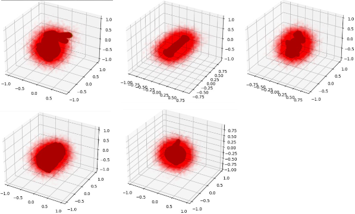

# NeRF for Surface Reconstruction

## 1. Introduction

This project is mainly hosted on `Colab`. Please follow the [link](https://drive.google.com/drive/folders/1Krgtfiz_hM_lUEUqfWDTY1Xcw4Trfnea?usp=sharing) to check out the full details of this project (some large files are not available on Github).

Please refer to `CMPT764_HW3.ipynb` (from [github page](CMPT764_HW3.ipynb) or [colab page](https://colab.research.google.com/drive/1NfzIHCpZnXV7rVNSqcpHRRQu1IvbIesE?usp=sharing)) to see how to install prerequisites, run the code, and reproduce the results.

Please also refer to my [presentation](Comparison_of_NeRF_models_for_Surface_Reconstruction.pdf) to get the main takeaway messages for this project.

**Topics:** _Neural Rendering_, _Surface Reconstruction_

**Skills:** _Pytorch_, _Python_, _Deep Neural Networks_, _Point Clouds_, _Jupyter Lab_, _Colab_

### 1.1 Background

`MLPs` have been proven to be surprisingly good at modelling complex spatially-varying functions, which include `radiance fields` (for rendering) and `occupancy fields` (for surface reconstruction). In this project, we explore how different implementation choices of NeRF might affect the quality and speed of surface reconstruction.

### 1.2 Tasks of the Project

- Implement NeRF model with single level of details;
- Implement NeRF model with multiple level of details;
- Implement the feature grid as a Hash grid;
- Compare the performance of the NeRF models with different implementation choices.

## 2. Demo and Conclusion

Below shows the surface reconstruction results. There are 5 objects that are used for our tests, namely, `bunny`, `column`, `dragon`, `serapis`, and `utah teapot`.

## 3. Reference

1. [ReLU Fields: Continuous 3D Convolutional Neural Fields for Shape Reconstruction](https://arxiv.org/pdf/2205.10824.pdf)

2. [Instant Neural Graphics Primitives with a Multiresolution Hash Encoding](https://nvlabs.github.io/instant-ngp/assets/mueller2022instant.pdf)

3. [NGLOD: Real-time Rendering with Implicit 3D Shapes](https://research.nvidia.com/labs/toronto-ai/nglod/assets/nglod.pdf)
